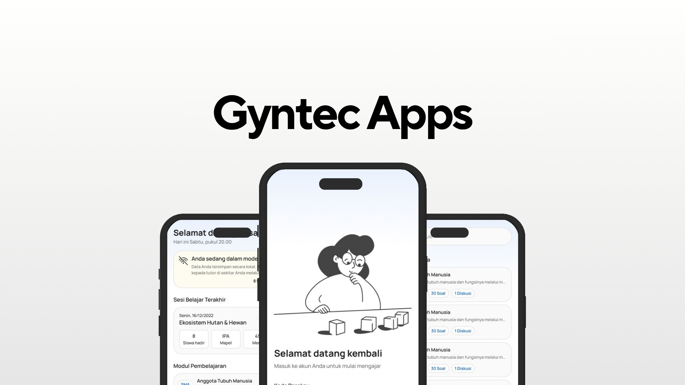

<p align="center">
  
</p>

<h1 align="center">Gyntec</h1>

<p align="center">
  Aplikasi pendamping pengajar untuk sesi belajar interaktif di kelas.<br />
  Materi, diskusi kelompok, dan kuis dalam satu alur yang terpadu.
</p>

<p align="center">
  
  
  
  
</p>

## Tentang Gyntec

Gyntec adalah aplikasi mobile berbasis Flutter yang dirancang untuk memfasilitasi proses pembelajaran interaktif di lingkungan pendidikan. Pengajar berperan sebagai operator utama yang menjalankan sesi, sementara peserta didik mengikuti alur pembelajaran yang dipandu langsung melalui layar.

Aplikasi ini dibangun dengan pendekatan mobile-first dan offline-friendly. Data modul tersimpan secara lokal sehingga sesi tetap dapat berjalan di lingkungan dengan koneksi terbatas, sementara status jaringan selalu ditampilkan agar pengajar mengetahui kondisi perangkat setiap saat.

## Fitur Utama

### Manajemen Modul
Pengajar dapat menelusuri daftar modul pembelajaran beserta detail kontennya, mulai dari materi teks dan gambar, pertanyaan diskusi kelompok, hingga pratinjau soal kuis.

### Manajemen Peserta
Data siswa dapat ditambahkan, dilihat, dan dikelola melalui halaman khusus. Sebelum sesi dimulai, pengajar memilih peserta yang hadir, lalu sistem membagi mereka ke dalam kelompok secara otomatis.

### Sesi Pembelajaran Tiga Tahap

| Tahap | Keterangan |
|:--|:--|
| 1. Materi | Pengajar mempresentasikan konten modul kepada peserta. |
| 2. Diskusi | Peserta berdiskusi dalam kelompok dengan timer countdown layar penuh. Setelah waktu habis, sesi otomatis berlanjut ke tahap kuis. |
| 3. Kuis | Soal ditampilkan satu per satu. Pengajar menandai kelompok yang menjawab benar, lalu menyelesaikan kuis melalui modal konfirmasi. |

### Rekap dan Riwayat Sesi
Setelah sesi selesai, ditampilkan rekap berisi informasi modul, perolehan poin setiap kelompok, dan daftar anggota masing-masing kelompok. Seluruh sesi yang telah berjalan tersimpan di halaman riwayat dan dapat dibuka kembali secara detail.

### Berbagi Modul
Modul dapat dikirim dan diterima antar perangkat pengajar di sekitar melalui fitur berbagi, lengkap dengan tampilan pemindaian perangkat dan pratinjau modul sebelum dikirim.

### Deteksi Status Jaringan
Banner offline muncul otomatis ketika perangkat tidak terhubung ke internet. Status diperbarui secara real-time melalui kombinasi stream event dan polling setiap 4 detik, serta dapat disegarkan manual dengan pull-to-refresh.

## Teknologi

| Komponen | Keterangan |
|:--|:--|
| Framework | Flutter 3.41.6 |
| Bahasa | Dart 3.11.4 |
| State Management | StatefulWidget (lokal, tanpa library eksternal) |
| Ikon | lucide_icons_flutter 3.1.20 |
| SVG | flutter_svg 2.3.0 |
| Konektivitas | connectivity_plus 7.3.1 |
| Sumber Data | JSON lokal via rootBundle (`assets/data/mock_data.json`) |

## Struktur Proyek

Proyek menggunakan arsitektur berbasis fitur (feature-first). Setiap fitur memiliki folder `models`, `screens`, dan `widgets` masing-masing, sementara komponen yang dipakai bersama ditempatkan di `core`.

```
gyntec/
  assets/
    data/                  Data modul, peserta, dan soal kuis (mock_data.json)
    MateriImage/           Gambar pendukung konten materi
    showcase/              Gambar showcase aplikasi
  lib/
    main.dart              Titik masuk aplikasi
    core/
      constants/           Palet warna aplikasi
      services/            Service deteksi status jaringan
      utils/               Utilitas umum (keyboard, dll)
      widgets/             Komponen bersama (button, input, top bar, nav bar, banner offline)
    features/
      auth/                Login dan model pengguna
      home/                Halaman utama, sesi terakhir, dan daftar modul
      module/              Daftar modul dan detail modul (Materi, Diskusi, Kuis)
      student/             Daftar, detail, dan penambahan siswa
      session/             Pemilihan peserta, sesi belajar, timer diskusi, rekap, dan riwayat
      sharing/             Hub berbagi, pemilihan modul, dan pengiriman ke perangkat lain
    utils/
      models.dart          Definisi model data umum
```

## Alur Navigasi

```
LoginScreen
  HomeScreen
    ModuleListScreen
      ModuleDetailScreen
        ParticipantSelectionScreen
          LearningSessionScreen
            DiscussionTimerScreen     (push / pop)
            QuizFinishModal           (dialog)
            PostQuizSummaryScreen
              HomeScreen              (pop until first)
    StudentScreen
      StudentDetailScreen
      AddStudentScreen
    SessionHistoryScreen
      SessionHistoryDetailScreen
    SharingHubScreen
      SelectModuleToSendScreen
        SendModuleScreen
```

## Memulai

### Prasyarat

Pastikan Flutter SDK versi 3.41 atau lebih baru sudah terpasang. Verifikasi dengan perintah berikut.

```bash
flutter doctor
```

### Instalasi dan Menjalankan

```bash
git clone https://github.com/Deanity/Gyntec.git
cd Gyntec
flutter pub get
flutter run
```

### Pengujian

```bash
flutter test
```

### Build APK Rilis

```bash
flutter build apk --release
```

File APK akan tersedia di `build/app/outputs/flutter-apk/app-release.apk`.

## Pengujian di Perangkat Fisik

1. Aktifkan **USB Debugging** melalui menu Developer Options pada perangkat Android.
2. Sambungkan perangkat ke komputer menggunakan kabel USB.
3. Jalankan `flutter run`. Flutter akan mendeteksi perangkat dan memasang aplikasi secara otomatis.

Untuk menguji banner offline, aktifkan mode pesawat pada perangkat. Banner akan muncul dalam waktu maksimal 4 detik. Tarik layar ke bawah untuk memperbarui status koneksi secara instan.

## Tentang Proyek

Gyntec dikembangkan sebagai karya untuk mengikuti kompetisi. Proyek ini lahir dari kebutuhan nyata di ruang kelas, yaitu bagaimana pengajar dapat mengelola sesi belajar interaktif secara terstruktur, tetap berjalan dalam kondisi koneksi terbatas, dan mendorong keterlibatan aktif peserta didik melalui diskusi kelompok dan kuis.

Seluruh data yang digunakan dalam aplikasi ini merupakan data contoh (mock data) untuk keperluan demonstrasi.

## Tim Pengembang

| Nama | Peran |
|:--|:--|
| I Gede Dhiyo Lawe Wikantara | UI/UX & Project Manager |
| Dendra De Tama  | Flutter Developer |


## Lisensi

Hak cipta dimiliki oleh tim pengembang. Proyek ini dibuat untuk keperluan kompetisi dan tidak diperuntukkan bagi penggunaan komersial tanpa izin.
