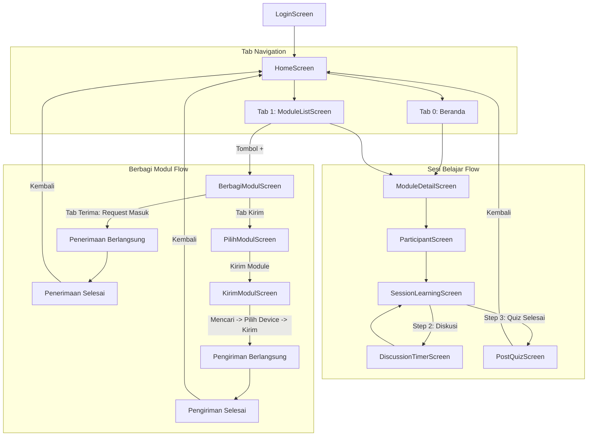

# Dokumentasi Struktur File & Arsitektur Project Gyntec

Dokumen ini menjelaskan struktur folder, alur kerja (flow), serta fungsi dan isi dari setiap file di dalam proyek aplikasi **Gyntec** (Flutter).

---

## 📁 Struktur Direktori Utama

```
lib/
├── main.dart
├── core/                        # Modul dasar global & shared core
│   ├── core.dart                # Barrel export modul core
│   ├── services/
│   │   └── connectivity_service.dart  # Deteksi koneksi internet/offline
│   ├── utils/
│   │   └── keyboard_utils.dart        # Helper dismiss keyboard
│   └── widgets/                       # Widget dasar aplikasi (AppButton, AppTopBar, dll.)
│       ├── core_widgets.dart          # Barrel export widget core
│       ├── app_bottom_nav_bar.dart    # Floating pill navigation bar utama
│       ├── app_button.dart            # Tombol utama aplikasi
│       ├── app_top_bar.dart           # Top navigation bar
│       ├── form_input.dart            # Input textfield reusable
│       ├── level_badge.dart           # Badge tingkat pendidikan (SMA, SMP, SMK)
│       ├── offline_banner_card.dart   # Banner status luring
│       └── section_header.dart        # Header section dengan action tap
├── features/                    # Modul fitur berbasis Feature-First
│   ├── auth/                    # Fitur Autentikasi
│   │   └── screens/
│   │       └── login_screen.dart      # Halaman login tutor
│   ├── home/                    # Fitur Beranda Dasbor
│   │   ├── screens/
│   │   │   └── home_screen.dart       # Halaman utama (IndexedStack 4 tab)
│   │   └── widgets/
│   │       ├── home_widgets.dart      # Barrel export widget home
│   │       ├── module_list_item.dart  # Baris modul di beranda
│   │       └── session_card.dart      # Kartu sesi belajar terakhir
│   ├── module/                  # Fitur Katalog & Pembelajaran Modul
│   │   ├── module.dart                # Barrel export modul fitur
│   │   ├── screens/
│   │   │   ├── module_list_screen.dart   # Tab katalog modul & pencarian real-time
│   │   │   └── module_detail_screen.dart # Pratinjau isi materi, soal, & indikator
│   │   └── widgets/
│   │       ├── module_widgets.dart       # Barrel export widget modul
│   │       ├── group_question_card.dart  # Card pertanyaan kelompok
│   │       ├── materi_content_block.dart # Blok teks materi pembelajaran
│   │       ├── materi_image_block.dart   # Blok ilustrasi gambar materi
│   │       ├── modul_bottom_action.dart  # Floating action button "Mulai Sesi"
│   │       ├── quiz_option_item.dart     # Pilihan ganda kuis
│   │       └── quiz_question_card.dart   # Card butir pertanyaan kuis
│   └── session/                 # Fitur Sesi Pembelajaran Kelas
│       ├── session.dart               # Barrel export modul sesi
│       ├── screens/
│       │   ├── participant_screen.dart      # Pemilihan & penambahan peserta kelas
│       │   ├── session_learning_screen.dart # Sesi kelas 3 langkah (Materi, Diskusi, Quiz)
│       │   ├── discussion_timer_screen.dart # Countdown timer diskusi kelompok
│       │   └── post_quiz_screen.dart        # Rekap skor akhir kuis kelompok
│       └── widgets/
│           ├── session_widgets.dart         # Barrel export widget sesi
│           ├── discussion_group_card.dart   # Card pembagian kelompok
│           ├── empty_participant_view.dart  # Tampilan kosong peserta
│           ├── no_participant_modal.dart    # Dialog peringatan tanpa peserta
│           ├── participant_badge.dart       # Badge info modul pada peserta
│           ├── participant_card.dart        # Card ringkasan data murid
│           ├── quiz_finish_modal.dart       # Modal konfirmasi selesai kuis
│           ├── quiz_group_select_card.dart  # Seleksi kelompok penjawab benar
│           ├── quiz_interactive_card.dart   # Card kuis interaktif
│           ├── session_bottom_nav.dart      # Floating bottom navbar sesi
│           └── session_stepper_header.dart  # Stepper header 3 langkah sesi
├── components/                  # Komponen spesifik domain
│   ├── components.dart          # Barrel export komponen
│   └── sharing/                 # Widget fitur Berbagi Modul (Bluetooth / Wi-Fi)
│       ├── device_select_card.dart
│       ├── module_preview_card.dart
│       ├── module_select_card.dart
│       ├── scanning_pulse_animation.dart
│       ├── scanning_status_view.dart
│       └── sharing_mode_tab.dart
├── mainScreen/                  # Halaman alur sharing modul
│   ├── berbagi_modul_screen.dart      # Alur terima modul & radar scan
│   ├── pilih_modul_screen.dart        # Multi-select modul untuk dikirim
│   └── kirim_modul_screen.dart        # Alur kirim modul ke perangkat tujuan
└── utils/                       # Data dummy dan definisi Model
    ├── data.json                      # Asset database lokal dummy
    └── models.dart                    # Data model Dart (UserModel, ModuleModel, dll.)
```

---

## 🗺️ Diagram Alur Navigasi Aplikasi



---

## 📄 Penjelasan Detail Setiap File

### 1. Root & Core (`lib/core/`)

* **`main.dart`**  
  Entry point utama aplikasi. Mengatur orientasi portrait, tema aplikasi (`#0066FF`), serta route awal ke `HomeScreen`.
* **`core/services/connectivity_service.dart`**  
  Service singleton untuk memeriksa status koneksi internet (online/offline) secara real-time via stream dan interval polling fallback.
* **`core/utils/keyboard_utils.dart`**  
  Helper utility untuk menutup keyboard virtual secara aman saat user mengetuk area luar textfield.
* **`core/widgets/app_bottom_nav_bar.dart`**  
  Floating pill bottom navigation bar di layar utama dengan 4 menu: Beranda, Modul, Sesi Belajar, Murid.
* **`core/widgets/app_button.dart`**  
  Komponen tombol utama berdesain pill rounded yang mendukung state loading dan kustomisasi warna/ukuran.
* **`core/widgets/app_top_bar.dart`**  
  Top navigation bar standar dengan tombol back chevron dan judul halaman.
* **`core/widgets/form_input.dart`**  
  Input field teks reusable dengan ikon prefix/suffix untuk form login dan input data.
* **`core/widgets/level_badge.dart`**  
  Badge kecil penanda jenjang pendidikan (SMA, SMP, SMK) dengan warna dinamis.
* **`core/widgets/offline_banner_card.dart`**  
  Banner informasi peringatan mode luring (offline) dengan keterangan jumlah modul tersimpan lokal.
* **`core/widgets/section_header.dart`**  
  Header judul bagian section yang dilengkapi tombol aksi "Lihat Semua".

---

### 2. Features (`lib/features/`)

#### A. Auth (`lib/features/auth/`)
* **`screens/login_screen.dart`**: Halaman login tutor pengajar.

#### B. Home (`lib/features/home/`)
* **`screens/home_screen.dart`**: Halaman dasbor utama (IndexedStack 4 tab).
* **`widgets/module_list_item.dart`**: Card baris modul di daftar vertikal Beranda.
* **`widgets/session_card.dart`**: Card horizontal sesi belajar terakhir.

#### C. Module (`lib/features/module/`)
* **`screens/module_list_screen.dart`**: Tab katalog modul, pencarian real-time, dan FAB (+) berbagi modul.
* **`screens/module_detail_screen.dart`**: Pratinjau isi materi modul, ilustrasi, contoh kuis, dan tombol "Mulai Sesi".
* **`widgets/group_question_card.dart`**: Card indikator dan pertanyaan diskusi kelompok.
* **`widgets/materi_content_block.dart`**: Komponen blok judul bab dan teks materi.
* **`widgets/materi_image_block.dart`**: Komponen penampil gambar materi pembelajaran.
* **`widgets/modul_bottom_action.dart`**: Floating action button bawah di layar detail modul ("Mulai Sesi").
* **`widgets/quiz_option_item.dart`**: Pilihan ganda interaktif soal kuis.
* **`widgets/quiz_question_card.dart`**: Card butir pertanyaan kuis.

#### D. Session (`lib/features/session/`)
* **`screens/participant_screen.dart`**: Pemilihan dan penambahan peserta didik sebelum sesi kelas dimulai.
* **`screens/session_learning_screen.dart`**: Sesi belajar kelas 3 langkah (Materi, Diskusi Kelompok, Quiz Interaktif).
* **`screens/discussion_timer_screen.dart`**: Countdown timer countdown fullscreen untuk sesi diskusi kelompok.
* **`screens/post_quiz_screen.dart`**: Rekapitulasi skor akhir tiap kelompok kuis dalam format accordion card.
* **`widgets/discussion_group_card.dart`**: Card pembagian kelompok siswa dan anggotanya.
* **`widgets/empty_participant_view.dart`**: Tampilan kosong saat belum ada peserta.
* **`widgets/no_participant_modal.dart`**: Modal dialog konfirmasi jika peserta masih kosong.
* **`widgets/participant_badge.dart`**: Badge informasi modul di layar peserta.
* **`widgets/participant_card.dart`**: Card item data peserta didik.
* **`widgets/quiz_finish_modal.dart`**: Modal dialog sebelum menyelesaikan kuis.
* **`widgets/quiz_group_select_card.dart`**: Card penentu kelompok yang menjawab benar pada kuis.
* **`widgets/quiz_interactive_card.dart`**: Card navigasi soal kuis interaktif.
* **`widgets/session_bottom_nav.dart`**: Floating bottom nav untuk navigasi 3 langkah sesi.
* **`widgets/session_stepper_header.dart`**: Stepper header di atas layar sesi belajar.

---

### 3. Sharing Screens (`lib/mainScreen/`)

* **`berbagi_modul_screen.dart`**: Alur terima modul (mencari perangkat, permintaan masuk, progress penerimaan, selesai terima).
* **`pilih_modul_screen.dart`**: Pemilihan modul untuk dikirim dengan checkbox multi-select.
* **`kirim_modul_screen.dart`**: Alur pengiriman modul (mencari perangkat tujuan, seleksi device, progress upload, selesai kirim).

---

### 4. Components Domain (`lib/components/`)

* **Sharing (`lib/components/sharing/`)**:
  - `device_select_card.dart`, `module_preview_card.dart`, `module_select_card.dart`, `scanning_pulse_animation.dart`, `scanning_status_view.dart`, `sharing_mode_tab.dart`.

---

### 5. Utilities & Data (`lib/utils/`)

* **`data.json`**: Database lokal mock untuk user, session, modul, materi, quiz, dan daftar murid.
* **`models.dart`**: Model data Dart lengkap dengan parser `fromJson` & `toJson`.
