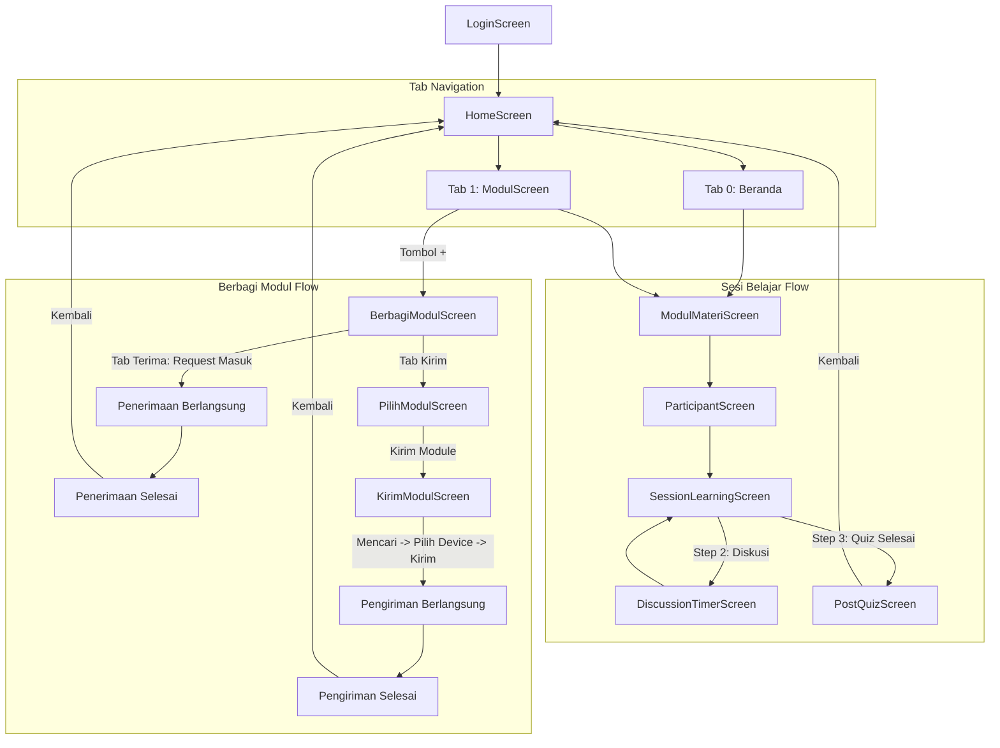

# Dokumentasi Struktur File & Arsitektur Project Gyntec

Dokumen ini menjelaskan struktur folder, alur kerja (flow), serta fungsi dan isi dari setiap file di dalam proyek aplikasi **Gyntec** (Flutter).

---

## 📁 Struktur Direktori Utama

```
lib/
├── main.dart
├── components/                  # Komponen UI modular dan reusable
│   ├── components.dart          # Barrel export untuk komponen umum
│   ├── common/                  # Widget dasar global (Button, Navbar, Badges, dll.)
│   ├── home/                    # Widget khusus halaman Beranda
│   ├── materi/                  # Widget untuk tampilan Modul Materi & Soal
│   ├── peserta/                 # Widget untuk pemilihan & daftar peserta
│   ├── session/                 # Widget sesi pembelajaran (Materi, Diskusi, Quiz)
│   └── sharing/                 # Widget fitur Berbagi Modul via Bluetooth/Wi-Fi
├── mainScreen/                  # Halaman / Screen utama aplikasi
│   ├── login_screen.dart
│   ├── home_screen.dart
│   ├── modul_screen.dart
│   ├── modul_materi_screen.dart
│   ├── participant_screen.dart
│   ├── session_learning_screen.dart
│   ├── discussion_timer_screen.dart
│   ├── post_quiz_screen.dart
│   ├── berbagi_modul_screen.dart
│   ├── pilih_modul_screen.dart
│   └── kirim_modul_screen.dart
└── utils/                       # Utilitas, Layanan, Model, dan Data Dummy
    ├── connectivity_service.dart
    ├── data.json
    ├── keyboard_utils.dart
    └── models.dart
```

---

## 🗺️ Diagram Alur Navigasi Aplikasi



---

## 📄 Penjelasan Detail Setiap File

### 1. Root (`lib/`)

* **`main.dart`**  
  Entry point utama aplikasi Flutter. Menginisialisasi preferensi orientasi layar (portrait), tema aplikasi (warna primer biru `#0066FF`, font Inter/default), serta memuat screen pertama (`HomeScreen` atau `LoginScreen`).

---

### 2. Main Screens (`lib/mainScreen/`)

* **`login_screen.dart`**  
  Halaman autentikasi login tutor/pengajar. Berisi form input ID/Email dan Kata Sandi, validasi form, serta navigasi menuju `HomeScreen`.

* **`home_screen.dart`**  
  Halaman dasbor utama aplikasi. Menggunakan `IndexedStack` untuk navigasi 4 tab bawah (Beranda, Modul, Sesi Belajar, Murid). Menampilkan salam pengguna, tanggal hari ini, banner status koneksi luring (offline banner), horizontal scroll sesi belajar terakhir, serta daftar modul pembelajaran.

* **`modul_screen.dart`**  
  Halaman tab "Modul". Menyediakan fitur pencarian modul secara real-time, daftar card modul dengan tag informasi (tingkat, mapel, jumlah soal, jumlah diskusi), serta Floating Action Button (+) untuk memulai alur berbagi modul.

* **`modul_materi_screen.dart`**  
  Halaman pratinjau detail isi modul pembelajaran. Menampilkan ringkasan materi, gambar penunjang, indikator pertanyaan diskusi kelompok, contoh soal kuis, serta tombol "Mulai Sesi" di bagian bawah.

* **`participant_screen.dart`**  
  Halaman penambahan peserta sebelum sesi belajar dimulai. Dilengkapi fitur pencarian peserta, overlay animasi tambah siswa baru/rekomendasi, kartu ringkasan peserta terpilih, dan floating action button "Mulai Sesi".

* **`session_learning_screen.dart`**  
  Halaman inti pelaksanaan sesi belajar kelas yang memandu 3 tahapan:
  1. *Bagian 1: Materi Umum* (membaca bahan materi).
  2. *Bagian 2: Diskusi Kelompok* (pembagian kelompok otomatis & instruksi diskusi).
  3. *Bagian 3: Quiz Kelompok* (kuis interaktif & pencatatan kelompok yang menjawab benar).  
  Menggunakan floating bottom navbar (pill capsule switcher + action button).

* **`discussion_timer_screen.dart`**  
  Halaman timer countdown fullscreen untuk sesi diskusi kelompok siswa (default 20 menit). Dilengkapi tombol play, pause, restart, serta navigasi otomatis ke step quiz saat waktu habis.

* **`post_quiz_screen.dart`**  
  Halaman rekapitulasi setelah sesi kuis selesai. Menampilkan perolehan skor akhir tiap kelompok dalam bentuk kartu accordion yang bisa dibuka-tutup, daftar nama anggota, serta tombol floating "Kembali ke Beranda".

* **`berbagi_modul_screen.dart`**  
  Halaman induk berbagi modul. Mengelola alur penerimaan file:
  - Radar pencarian perangkat sekitar.
  - Notifikasi request kiriman masuk dari tutor lain.
  - Animasi progress penerimaan modul.
  - Tampilan sukses penerimaan modul (`recive-done`) dengan tombol "Kembali".

* **`pilih_modul_screen.dart`**  
  Halaman pemilihan modul yang akan dikirim ke perangkat lain. Menyediakan multi-select card dengan checkbox animasi dan floating button "Kirim Module" (otomatis aktif saat ada modul yang dipilih).

* **`kirim_modul_screen.dart`**  
  Halaman alur pengiriman modul:
  - Scanning perangkat tujuan terdekat via Bluetooth/Wi-Fi Direct.
  - Seleksi perangkat penerima (*Rama (SM-1980)*, *iPad Olivia*).
  - Tampilan pengiriman berlangsung dengan progress bar dan tombol "Batal".
  - Tampilan sukses pengiriman modul (`sending-done`) dengan tombol "Kembali".

---

### 3. Components (`lib/components/`)

Folder ini berisi subkomponen UI yang dipecah modular agar kode bersih (*clean code*) dan mudah digunakan kembali (*reusable*).

#### A. Common (`lib/components/common/`)
* **`bottom_nav_bar.dart` (`HomeBottomNavBar`)**:  
  Floating pill bottom navigation bar di layar utama dengan 4 menu: Beranda, Modul, Sesi Belajar, Murid.
* **`button.dart` (`CustomButton`)**:  
  Komponen tombol utama berdesain pill rounded yang mendukung state loading dan kustomisasi warna/ukuran.
* **`custom_top_bar.dart` (`CustomTopBar`)**:  
  Top navigation bar standar dengan tombol back chevron dan judul halaman.
* **`form_input.dart` (`FormInput`)**:  
  Input field teks reusable dengan ikon prefix/suffix untuk form login dan input data.
* **`level_badge.dart` (`LevelBadge`)**:  
  Badge kecil penanda jenjang pendidikan (SMA, SMP, SMK) dengan warna dinamis.
* **`offline_banner_card.dart` (`OfflineBannerCard`)**:  
  Banner informasi peringatan mode luring (offline) dengan keterangan jumlah modul tersimpan lokal.
* **`section_header.dart` (`SectionHeader`)**:  
  Header judul bagian section yang dilengkapi tombol aksi "Lihat Semua".

#### B. Home (`lib/components/home/`)
* **`module_list_item.dart` (`ModuleListItem`)**:  
  Card baris modul pada daftar vertikal di halaman Beranda.
* **`session_card.dart` (`SessionCard`)**:  
  Card horizontal sesi belajar terakhir, menampilkan tanggal, jenjang, mata pelajaran, jumlah murid, dan durasi.

#### C. Materi (`lib/components/materi/`)
* **`group_question_card.dart`**: Card instruksi dan indikator diskusi kelompok.
* **`materi_content_block.dart`**: Komponen tipografi judul bab dan paragraf isi materi.
* **`materi_image_block.dart`**: Komponen penampil ilustrasi gambar materi dengan styling rounded border.
* **`modul_bottom_action.dart`**: Floating action button bawah di layar detail modul ("Mulai Sesi").
* **`quiz_option_item.dart`**: Item radio pilihan ganda interaktif (A, B, C, D) pada kuis.
* **`quiz_question_card.dart`**: Card penampil butir soal pertanyaan kuis.

#### D. Peserta (`lib/components/peserta/`)
* **`empty_participant_view.dart`**: Tampilan ilustrasi dan pesan kosong saat belum ada peserta yang ditambahkan.
* **`no_participant_modal.dart`**: Dialog pop-up peringatan jika guru memulai sesi tanpa peserta.
* **`participant_badge.dart`**: Tag badge informasi modul di halaman penambahan peserta.
* **`participant_card.dart`**: Card item ringkasan data siswa/peserta didik.

#### E. Session (`lib/components/session/`)
* **`discussion_group_card.dart`**: Card pembagian kelompok siswa beserta daftar nama anggotanya.
* **`quiz_finish_modal.dart`**: Modal dialog konfirmasi sebelum menyelesaikan sesi kuis (menampilkan jumlah soal belum terjawab).
* **`quiz_group_select_card.dart`**: Card seleksi kelompok mana yang menjawab soal dengan benar.
* **`quiz_interactive_card.dart`**: Card soal kuis interaktif dengan tombol "Sebelumnya" dan "Berikutnya".
* **`session_bottom_nav.dart`**: Navigasi bawah floating dengan pill switcher (Materi, Diskusi, Quiz) dan tombol aksi utama.
* **`session_stepper_header.dart`**: Header atas penunjuk langkah sesi belajar (Step 1, 2, 3) beserta tombol back.

#### F. Sharing (`lib/components/sharing/`)
* **`device_select_card.dart`**: Card pilihan perangkat tujuan pengiriman dengan avatar dinamis, nama perangkat, dan checkbox seleksi.
* **`module_preview_card.dart`**: Card ringkasan modul yang sedang dikirim/diterima dengan label kepemilikan dan badge spesifikasi.
* **`module_select_card.dart`**: Card modul dengan checkbox untuk multi-select pada halaman Pilih Modul.
* **`scanning_pulse_animation.dart`**: Animasi radar pulsa gelombang konsentris dengan delay berulang (*staggered ripple effect*).
* **`scanning_status_view.dart`**: Komponen gabungan animasi radar + judul status + subjudul instruksi.
* **`sharing_mode_tab.dart`**: Tab switcher pill mengambang untuk beralih antara mode **"Terima"** dan **"Kirim"**.

---

### 4. Utilities & Data (`lib/utils/`)

* **`connectivity_service.dart`**  
  Service singleton untuk memeriksa koneksi internet (online/offline) secara real-time via stream dan interval polling fallback.

* **`data.json`**  
  File data lokal (mock asset) yang menyimpan:
  - Profil pengguna (`user`).
  - Data banner offline (`offlineBanner`).
  - Riwayat sesi belajar (`recentSessions`).
  - Katalog modul pembelajaran (`modules`).
  - Isi materi, soal kuis, dan pertanyaan diskusi (`modulDetail`).
  - Database daftar murid/peserta didik (`students`).

* **`keyboard_utils.dart`**  
  Fungsi pembantu (*helper utility*) untuk menutup keyboard virtual (`dismissKeyboard`) secara aman saat user mengetuk area luar input.

* **`models.dart`**  
  Definisi struktur data model Dart (lengkap dengan serialisasi `fromJson` & `toJson`):
  - `UserModel`
  - `OfflineBannerModel`
  - `SessionModel`
  - `ModuleModel`
  - `MateriBlockModel`
  - `GroupQuestionModel`
  - `QuizQuestionModel`
  - `ModulDetailModel`
  - `StudentModel`
  - `DiscussionGroupModel`

---

## 🎯 Panduan Penambahan Fitur Baru

1. **Membuat Screen Baru**: Tempatkan file baru pada direktori `lib/mainScreen/`.
2. **Membuat Komponen UI Reusable**: Pisahkan widget ke dalam subfolder yang relevan di `lib/components/`. Hindari menulis widget lebih dari 300 baris dalam satu file screen.
3. **Data & State**: Bila menambahkan entitas data baru, daftarkan modelnya di `lib/utils/models.dart` dan sertakan contoh datanya pada `lib/utils/data.json`.
