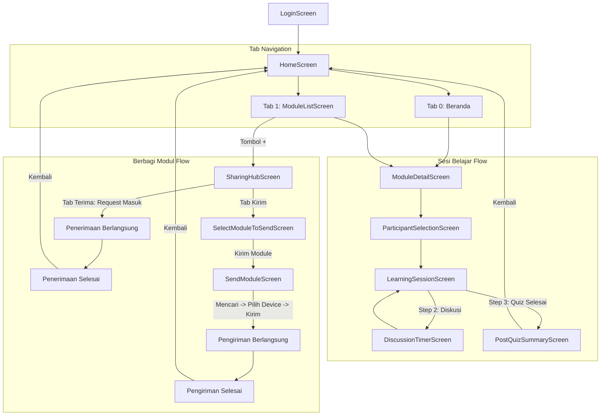

# Dokumentasi Struktur File & Arsitektur Project Gyntec

Dokumen ini menjelaskan struktur folder, alur kerja (flow), serta fungsi dan isi dari setiap file di dalam proyek aplikasi **Gyntec** (Flutter) berbasis arsitektur modular **Feature-First**.

---

## 📁 Struktur Direktori Utama

```
lib/
│
├── main.dart
│
├── core/                                # Hal-hal global yang dipakai lintas fitur
│   ├── core.dart                        # Barrel export modul core
│   ├── constants/                       # App colors, text styles, asset paths
│   │   └── app_colors.dart
│   ├── services/                        # Service global / koneksi
│   │   └── connectivity_service.dart
│   ├── utils/                           # Helper murni
│   │   └── keyboard_utils.dart
│   └── widgets/                         # Widget dasar yang dipakai di seluruh app
│       ├── core_widgets.dart            # Barrel export widget core
│       ├── app_button.dart              # Tombol utama aplikasi (pill rounded)
│       ├── app_top_bar.dart             # Top navigation bar
│       ├── app_bottom_nav_bar.dart      # Floating pill bottom navigation bar
│       ├── form_input.dart              # Form textfield reusable
│       ├── level_badge.dart             # Badge tingkat pendidikan (SMA, SMP, SMK)
│       ├── offline_banner_card.dart     # Banner status luring (offline)
│       └── section_header.dart          # Header section dengan action tap
│
├── features/                            # Modul/fitur utama aplikasi
│   │
│   ├── auth/                            # Fitur Login / Autentikasi
│   │   ├── auth.dart                    # Barrel export fitur auth
│   │   ├── models/
│   │   │   └── user_model.dart          # UserModel & OfflineBannerModel
│   │   └── screens/
│   │       └── login_screen.dart        # Layar autentikasi tutor
│   │
│   ├── home/                            # Fitur Beranda & Ringkasan
│   │   ├── screens/
│   │   │   └── home_screen.dart         # Layar dasbor utama (IndexedStack 4 tab)
│   │   └── widgets/
│   │       ├── home_widgets.dart        # Barrel export widget home
│   │       ├── module_list_item.dart    # Baris modul di daftar vertikal beranda
│   │       └── recent_session_card.dart # Kartu sesi belajar terakhir
│   │
│   ├── module/                          # Fitur Katalog & Pembaca Materi Modul
│   │   ├── module.dart                  # Barrel export fitur module
│   │   ├── models/
│   │   │   ├── module_model.dart        # ModuleModel
│   │   │   └── module_detail_model.dart # ModuleDetailModel & MateriBlockModel
│   │   ├── screens/
│   │   │   ├── module_list_screen.dart  # Katalog modul & search bar real-time
│   │   │   └── module_detail_screen.dart# Pratinjau materi, indikator, & kuis
│   │   └── widgets/
│   │       ├── module_widgets.dart      # Barrel export widget module
│   │       ├── content_block_view.dart  # Blok teks konten materi
│   │       ├── image_block_view.dart    # Blok ilustrasi gambar materi
│   │       ├── group_question_card.dart # Card pertanyaan kelompok & indikator
│   │       ├── modul_bottom_action.dart # Action button "Mulai Sesi"
│   │       ├── quiz_option_item.dart    # Pilihan ganda kuis
│   │       └── quiz_question_card.dart  # Card butir pertanyaan kuis
│   │
│   ├── session/                         # Fitur Sesi Belajar, Diskusi, & Quiz
│   │   ├── session.dart                 # Barrel export fitur session
│   │   ├── models/
│   │   │   ├── session_model.dart       # SessionModel
│   │   │   ├── student_model.dart       # StudentModel & DiscussionGroupModel
│   │   │   └── quiz_question_model.dart # QuizQuestionModel
│   │   ├── screens/
│   │   │   ├── participant_selection_screen.dart # Pemilihan & penambahan peserta didik
│   │   │   ├── learning_session_screen.dart      # Alur sesi kelas 3 langkah
│   │   │   ├── discussion_timer_screen.dart      # Countdown timer diskusi fullscreen
│   │   │   └── post_quiz_summary_screen.dart     # Rekap perolehan skor kelompok
│   │   └── widgets/
│   │       ├── session_widgets.dart              # Barrel export widget session
│   │       ├── discussion_group_card.dart        # Card pembagian kelompok siswa
│   │       ├── quiz_interactive_card.dart        # Card kuis interaktif
│   │       ├── quiz_group_selector.dart          # Penentu kelompok penjawab benar
│   │       ├── quiz_finish_modal.dart            # Modal dialog konfirmasi selesai kuis
│   │       ├── no_participant_modal.dart         # Dialog peringatan tanpa peserta
│   │       ├── empty_participant_view.dart       # Tampilan kosong daftar peserta
│   │       ├── participant_badge.dart            # Badge info modul pada peserta
│   │       ├── participant_card.dart             # Card data murid
│   │       ├── session_bottom_nav.dart           # Floating bottom nav sesi
│   │       └── session_stepper_header.dart       # Stepper header 3 tahapan sesi
│   │
│   └── sharing/                         # Fitur Berbagi Modul Luring (Peer-to-Peer)
│       ├── sharing.dart                 # Barrel export fitur sharing
│       ├── screens/
│       │   ├── sharing_hub_screen.dart           # Layar hub terima modul & radar scan
│       │   ├── select_module_to_send_screen.dart # Multi-select modul untuk dikirim
│       │   └── send_module_screen.dart           # Layar alur kirim modul ke perangkat
│       └── widgets/
│           ├── sharing_widgets.dart              # Barrel export widget sharing
│           ├── device_select_card.dart           # Card pilihan perangkat target yang ditemukan
│           ├── module_preview_card.dart          # Card preview modul yang diterima
│           ├── module_select_card.dart           # Card modul dengan checkbox interaktif
│           ├── scanning_radar_view.dart          # Animasi radar pulsa & status scanning
│           └── sharing_mode_tab.dart             # Tab switch mode Terima vs Kirim
│
└── utils/                               # Backward-compatibility barrel
    └── models.dart                      # Re-export seluruh models dari features/

assets/                                  # Assets aplikasi
├── MateriImage/                         # Ilustrasi gambar materi pembelajaran
└── data/
    └── mock_data.json                   # Asset mock data lokal
```

---

## 🗺️ Diagram Alur Navigasi Aplikasi



---

## 🚦 Rangkuman Tahapan Migrasi (Roadmap Selesai)

* [x] **[Langkah 1] Setup Core Foundation (Services, Utils, & Global Widgets)**:
  - Pembentukan `core/constants/app_colors.dart`, `core/services/connectivity_service.dart`, `core/utils/keyboard_utils.dart`, dan kumpulan widget reusable dasar.
* [x] **[Langkah 2] Fitur Auth (Login Screen & UserModel)**:
  - Pemindahan ke `features/auth/screens/login_screen.dart` dan `features/auth/models/user_model.dart`.
* [x] **[Langkah 3] Fitur Home (Home Dashboard & Widget Terkait)**:
  - `features/home/screens/home_screen.dart` dan `recent_session_card.dart` + `module_list_item.dart`.
* [x] **[Langkah 4] Fitur Module (Katalog, Detail Materi, & Models)**:
  - `features/module/screens/module_list_screen.dart`, `module_detail_screen.dart`, `content_block_view.dart`, `image_block_view.dart`, dan model modular.
* [x] **[Langkah 5] Fitur Session (Peserta, Sesi Belajar, Timer, Post Quiz)**:
  - `participant_selection_screen.dart`, `learning_session_screen.dart`, `discussion_timer_screen.dart`, `post_quiz_summary_screen.dart`, `quiz_group_selector.dart`, dan model session/quiz.
* [x] **[Langkah 6] Fitur Sharing (Sharing Hub, Select Module, Send Module)**:
  - `sharing_hub_screen.dart`, `select_module_to_send_screen.dart`, `send_module_screen.dart`, serta widget `scanning_radar_view.dart`.
* [x] **[Langkah 7] Cleanup & Update Dokumentasi StructureFile.md**:
  - Migrasi `mock_data.json` ke folder `assets/data/`, pembersihan folder lama (`mainScreen/`, `components/`, `test/`), verifikasi `flutter analyze` 0 issue, dan dokumentasi arsitektur final.
