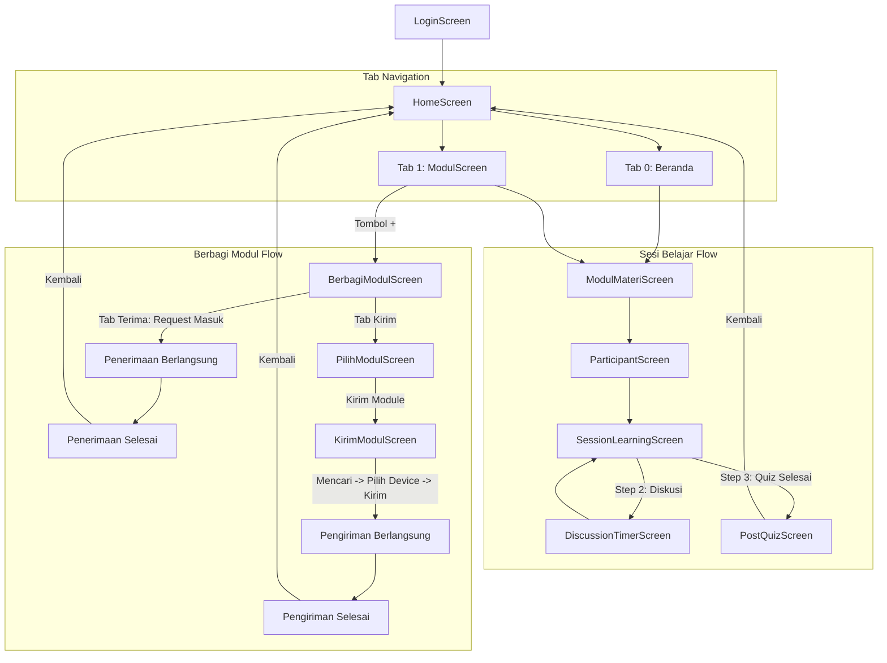

# Dokumentasi Struktur File & Arsitektur Project Gyntec

Dokumen ini menjelaskan struktur folder, alur kerja (flow), serta fungsi dan isi dari setiap file di dalam proyek aplikasi **Gyntec** (Flutter).

---

## 📁 Struktur Direktori Utama

```
lib/
├── main.dart
├── core/                        # Modul dasar global & shared core
│   ├── core.dart                # Barrel export modul core
│   ├── services/
│   │   └── connectivity_service.dart  # Deteksi koneksi internet/offline
│   ├── utils/
│   │   └── keyboard_utils.dart        # Helper dismiss keyboard
│   └── widgets/                       # Widget dasar aplikasi (AppButton, AppTopBar, dll.)
│       ├── core_widgets.dart          # Barrel export widget core
│       ├── app_bottom_nav_bar.dart    # Floating pill navigation bar utama
│       ├── app_button.dart            # Tombol utama aplikasi
│       ├── app_top_bar.dart           # Top navigation bar
│       ├── form_input.dart            # Input textfield reusable
│       ├── level_badge.dart           # Badge tingkat pendidikan (SMA, SMP, SMK)
│       ├── offline_banner_card.dart   # Banner status luring
│       └── section_header.dart        # Header section dengan action tap
├── features/                    # Modul fitur berbasis Feature-First
│   ├── auth/                    # Fitur Autentikasi
│   │   └── screens/
│   │       └── login_screen.dart      # Halaman login tutor
│   └── home/                    # Fitur Beranda Dasbor
│       ├── screens/
│       │   └── home_screen.dart       # Halaman utama (IndexedStack 4 tab)
│       └── widgets/
│           ├── home_widgets.dart      # Barrel export widget home
│           ├── module_list_item.dart  # Baris modul di beranda
│           └── session_card.dart      # Kartu sesi belajar terakhir
├── components/                  # Komponen UI spesifik domain pembelajaran
│   ├── components.dart          # Barrel export komponen
│   ├── materi/                  # Widget detail materi & latihan soal
│   │   ├── group_question_card.dart
│   │   ├── materi_content_block.dart
│   │   ├── materi_image_block.dart
│   │   ├── modul_bottom_action.dart
│   │   ├── quiz_option_item.dart
│   │   └── quiz_question_card.dart
│   ├── peserta/                 # Widget pemilihan & penambahan peserta
│   │   ├── empty_participant_view.dart
│   │   ├── no_participant_modal.dart
│   │   ├── participant_badge.dart
│   │   └── participant_card.dart
│   ├── session/                 # Widget sesi belajar kelas (Materi, Diskusi, Quiz)
│   │   ├── discussion_group_card.dart
│   │   ├── quiz_finish_modal.dart
│   │   ├── quiz_group_select_card.dart
│   │   ├── quiz_interactive_card.dart
│   │   ├── session_bottom_nav.dart
│   │   └── session_stepper_header.dart
│   └── sharing/                 # Widget fitur Berbagi Modul (Bluetooth / Wi-Fi)
│       ├── device_select_card.dart
│       ├── module_preview_card.dart
│       ├── module_select_card.dart
│       ├── scanning_pulse_animation.dart
│       ├── scanning_status_view.dart
│       └── sharing_mode_tab.dart
├── mainScreen/                  # Halaman alur pembelajaran & sharing
│   ├── modul_screen.dart              # Tab katalog modul & pencarian
│   ├── modul_materi_screen.dart       # Pratinjau detail isi modul
│   ├── participant_screen.dart        # Pengelolaan peserta sesi belajar
│   ├── session_learning_screen.dart   # Sesi kelas 3 langkah (Materi, Diskusi, Quiz)
│   ├── discussion_timer_screen.dart   # Countdown timer diskusi kelompok
│   ├── post_quiz_screen.dart          # Rekap skor akhir kuis kelompok
│   ├── berbagi_modul_screen.dart      # Alur terima modul & radar scan
│   ├── pilih_modul_screen.dart        # Multi-select modul untuk dikirim
│   └── kirim_modul_screen.dart        # Alur kirim modul ke perangkat tujuan
└── utils/                       # Data dummy dan definisi Model
    ├── data.json                      # Asset database lokal dummy
    └── models.dart                    # Data model Dart (UserModel, ModuleModel, dll.)
```

---

## 🗺️ Diagram Alur Navigasi Aplikasi



---

## 📄 Penjelasan Detail Setiap File

### 1. Root & Core (`lib/core/`)

* **`main.dart`**  
  Entry point utama aplikasi. Mengatur orientasi vertikal (portrait), tema aplikasi (warna primer `#0066FF`), serta route awal ke `HomeScreen`.
* **`core/services/connectivity_service.dart`**  
  Service singleton untuk memeriksa status koneksi internet (online/offline) secara real-time via stream dan interval polling fallback.
* **`core/utils/keyboard_utils.dart`**  
  Helper utility untuk menutup keyboard virtual secara aman saat user mengetuk area luar textfield.
* **`core/widgets/app_bottom_nav_bar.dart`**  
  Floating pill bottom navigation bar di layar utama dengan 4 menu: Beranda, Modul, Sesi Belajar, Murid.
* **`core/widgets/app_button.dart`**  
  Komponen tombol utama berdesain pill rounded yang mendukung state loading dan kustomisasi warna/ukuran.
* **`core/widgets/app_top_bar.dart`**  
  Top navigation bar standar dengan tombol back chevron dan judul halaman.
* **`core/widgets/form_input.dart`**  
  Input field teks reusable dengan ikon prefix/suffix untuk form login dan input data.
* **`core/widgets/level_badge.dart`**  
  Badge kecil penanda jenjang pendidikan (SMA, SMP, SMK) dengan warna dinamis.
* **`core/widgets/offline_banner_card.dart`**  
  Banner informasi peringatan mode luring (offline) dengan keterangan jumlah modul tersimpan lokal.
* **`core/widgets/section_header.dart`**  
  Header judul bagian section yang dilengkapi tombol aksi "Lihat Semua".

---

### 2. Features (`lib/features/`)

* **`features/auth/screens/login_screen.dart`**  
  Halaman autentikasi login tutor/pengajar.
* **`features/home/screens/home_screen.dart`**  
  Halaman dasbor utama aplikasi. Menggunakan `IndexedStack` untuk navigasi 4 tab bawah (Beranda, Modul, Sesi Belajar, Murid).
* **`features/home/widgets/module_list_item.dart`**  
  Card baris modul pada daftar vertikal di halaman Beranda.
* **`features/home/widgets/session_card.dart`**  
  Card horizontal sesi belajar terakhir (tanggal, jenjang, mata pelajaran, jumlah murid, durasi).

---

### 3. Main Screens (`lib/mainScreen/`)

* **`modul_screen.dart`**  
  Halaman tab "Modul" berisi search bar real-time, card modul lengkap dengan tag, dan FAB (+) untuk berbagi modul.
* **`modul_materi_screen.dart`**  
  Halaman pratinjau isi materi modul, gambar penunjang, indikator diskusi, contoh soal kuis, dan tombol "Mulai Sesi".
* **`participant_screen.dart`**  
  Halaman pemilihan & penambahan siswa/peserta didik sebelum sesi kelas dimulai.
* **`session_learning_screen.dart`**  
  Halaman inti pelaksanaan sesi belajar kelas (Materi, Diskusi Kelompok, Quiz Interaktif).
* **`discussion_timer_screen.dart`**  
  Halaman timer countdown fullscreen untuk sesi diskusi kelompok.
* **`post_quiz_screen.dart`**  
  Halaman rekapitulasi skor akhir tiap kelompok kuis dalam format accordion card.
* **`berbagi_modul_screen.dart`**  
  Halaman berbagi modul (mencari perangkat, permintaan kiriman masuk, progress penerimaan, selesai terima).
* **`pilih_modul_screen.dart`**  
  Halaman pemilihan modul yang akan dikirim ke perangkat tujuan dengan checkbox multi-select.
* **`kirim_modul_screen.dart`**  
  Halaman alur pengiriman modul (mencari perangkat, seleksi perangkat penerima, progress bar upload, selesai kirim).

---

### 4. Components Domain (`lib/components/`)

* **Materi (`lib/components/materi/`)**:
  - `group_question_card.dart`, `materi_content_block.dart`, `materi_image_block.dart`, `modul_bottom_action.dart`, `quiz_option_item.dart`, `quiz_question_card.dart`.
* **Peserta (`lib/components/peserta/`)**:
  - `empty_participant_view.dart`, `no_participant_modal.dart`, `participant_badge.dart`, `participant_card.dart`.
* **Session (`lib/components/session/`)**:
  - `discussion_group_card.dart`, `quiz_finish_modal.dart`, `quiz_group_select_card.dart`, `quiz_interactive_card.dart`, `session_bottom_nav.dart`, `session_stepper_header.dart`.
* **Sharing (`lib/components/sharing/`)**:
  - `device_select_card.dart`, `module_preview_card.dart`, `module_select_card.dart`, `scanning_pulse_animation.dart`, `scanning_status_view.dart`, `sharing_mode_tab.dart`.

---

### 5. Utilities & Data (`lib/utils/`)

* **`data.json`**: Database lokal mock untuk user, session, modul, materi, quiz, dan daftar murid.
* **`models.dart`**: Model data Dart lengkap dengan parser `fromJson` & `toJson`.
